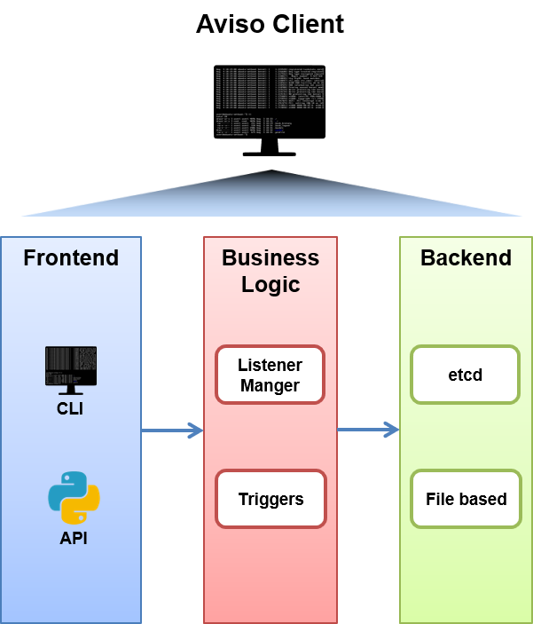

.. _aviso_client:

Aviso Client Architecture
=========================

Figure below shows the high-level architecture of Aviso client.



The whole Aviso Client application is implemented by the project package ``pyaviso``.
It provides two kinds of interfaces to users, a Python API for integration in user’s applications and a Command Line Interface (CLI) to use it 
as standalone application. The latter uses internally the Python API, implemented by the ```notification_manager`` module.
This module relies on the ``listener_manager`` module to translate the user's listener configuration into requests for the store.

The Listener Manager encapsulates the domain-specific listener semantic and is therefore in charge of the listener validation and the creation of the various ``EventListener``.
These entities map users' requests and represent independent listening threads that execute the triggers as independent processes in case of a valid notification is received.

The backend of the application is implemented by the ``engine`` package. The ``Engine`` offers a common interface to the requests arriving from the 
business layer and directed to the key-value store. Different implementations are available depending on the protocol used by the Key-Value store.
Currently the store considered are etcd_ and a file-based store used only in `TestMode`.


.. _etcd: https://etcd.io/