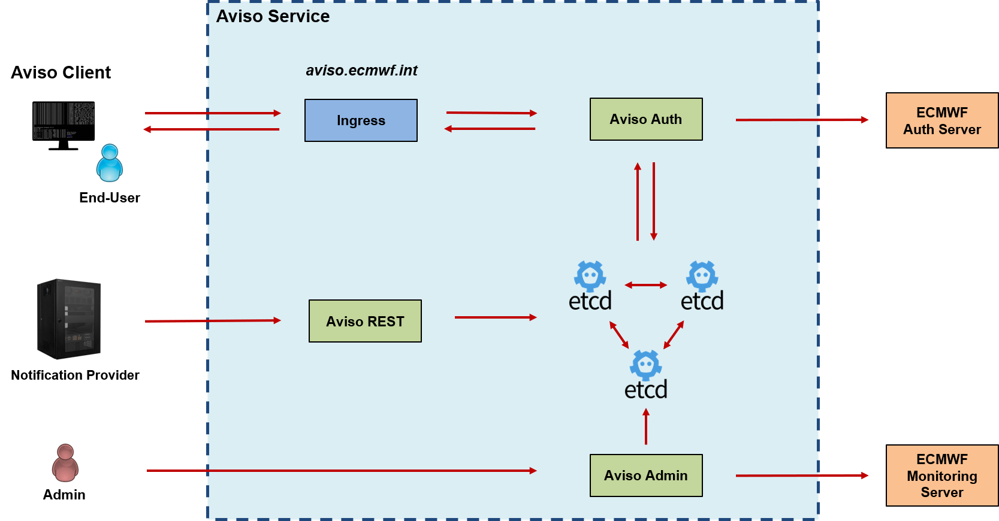

.. highlight:: console

.. _aviso_server:

Aviso Server Architecture
=========================

Figure below shows the high-level architecture of Aviso server.

The source of the components presented here is available in the ``aviso-server`` folder of the project. The remaining part of this section, briefly introduces each component. 

Key-Value store
---------------
The core component of Aviso service is a Key-Value store. This is a critical component because it guarantees persistency and consistency for all the notifications processed.
The current Key-Value store technology used is etcd_. This is a strongly consistent, distributed key-value store able to reach consensus thanks to Raft algorithm.
This allows it to gracefully tolerate machine failure and network partition. Moreover, it is designed for high-throughput.
We are running it in is default configuration of a cluster of 3 components.

.. note::

   All the other components of the Aviso Service are built independent of the technology used for the store. The same applies for Aviso client that completely hides to the user the 
   etcd API.

.. _etcd: https://etcd.io/

Aviso REST
----------

This component is a REST frontend that allows notification providers to submit notifications to the Aviso service 
via REST. Internally it uses Aviso API as if it was a client towards the store.

Install it by, from the main project directory:: 
   
   % pip install -e .
   % pip install -e aviso-server/monitoring
   % pip install -e aviso-server/rest

The `aviso` and `aviso-monitoring` packages are required by `aviso-rest`.

Launch it by::

   % aviso-rest

Aviso Auth
----------

Aviso Auth is a web application implementing a proxy responsible for authenticating the end-users' 
requests directed to the store. This allows to not rely on the store native authentication and authorisation 
capability while using ECMWF centralised resources. It follows a 2-steps process:

1. The request is validated against the ECMWF authentication server by checking the token associated to the request.
2. The user associated to the token is checked if he can access to the resource is asking notifications for. This is performed by requesting the allowed resources associated to the user from the ECMWF authorisation server.

If both steps are successful the request is forwarded to the store.

.. note::
 
   Currently only the ``listen`` command is allowed by this component. Any other operation is not authorised.

Install it by, from the main project directory:: 
   
   % pip install -e aviso-server/monitoring
   % pip install -e aviso-server/auth 

The `aviso-monitoring` package is required by `aviso-auth`.

Launch it by::

   % aviso-auth

Aviso Admin
-----------

This component performs maintenance operations to the store in order to keep it at constant size.
Currently the implementation is specific for an etcd store. This store requires the following operations:

* Compaction, this operation removes the history older than a certain date
* Deletion, this operation deletes all the keys older than a certain date

This component also uses the _monitoring_ package to run a UDP server to receive telemetries from all the other
components on the server. It runs a periodic aggregation and evaluation of these telemetries and it 
then communicates the status of the components to the ECMWF monitoring server.

Install it by, from the main project directory:: 
   
   % pip install -e aviso-server/monitoring
   % pip install -e aviso-server/admin 

The `aviso-monitoring` package is required by `aviso-admin`.

Launch it by::

   % aviso-admin

Monitoring
----------------

The package called ``aviso_monitoring`` allows the implementation of the monitoring system designed for the Aviso service.
It is a library that any other components can use either for:

* Collecting telemetries inside the component application, aggregate them and send them via UDP package
* Collecting telemetries from other components via a UDP server, aggregate and evaluate them and send them to a monitoring server.

The first capability is currently used by the components Aviso Rest and Aviso Auth.
The second capability is used by the Aviso Admin component.

Install it by, from the main project directory:: 
   
   % pip install -e aviso-server/monitoring 