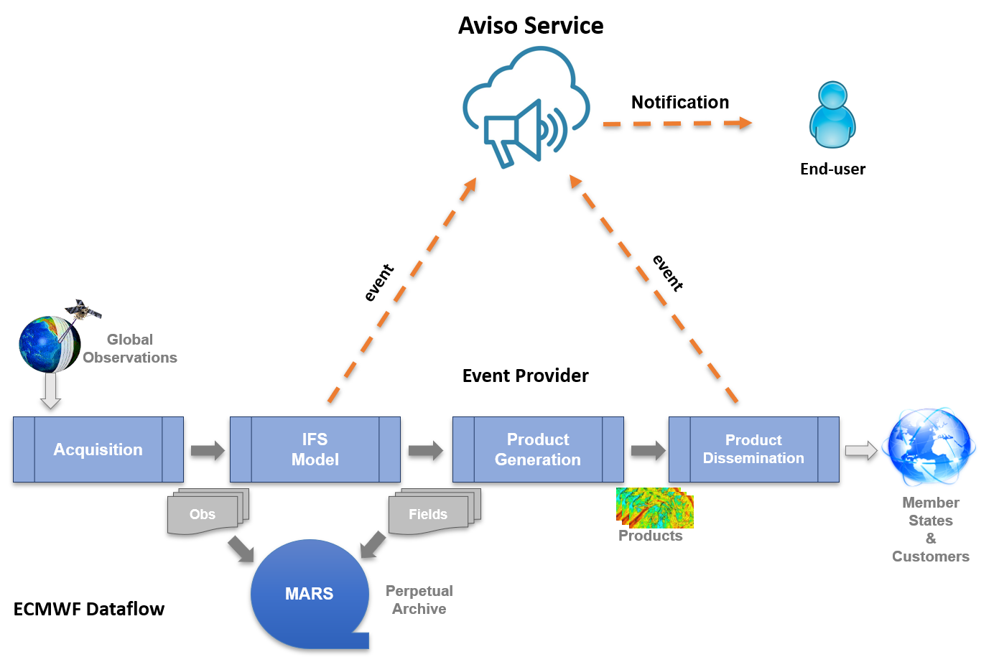

.. _aviso_ecmwf:

How Aviso Works at ECMWF
========================

This section presents how Aviso has been configured and deployed at ECMWF. This is a real-life example of usage of Aviso as well as a service users can request to access.

ECMWF Aviso service
-------------------

ECMWF has deployed Aviso as a notification service for the data availability of:

* Real-Time Model Output Data
* Products delivered via ECMWF dissemination system

Figure below shows ECMWF data flow; it starts from the data assimilation of observations, it then follows to the generation of the model output, the real-time global forecast. 
This is a time critical step for users' workflows and therefore its completion is notified by Aviso. The data flow continues with the generation of derived products that are then
disseminated via ECMWF dissemination system. The delivery of these products is also notified by Aviso as users depend on custom products for their downstream applications.  

This service is based on the Aviso server solution presented in :ref:`aviso_server`. This server is currently receiving over 300k notifications a day.

.. warning::

   ECMWF Aviso service is currently limited to registered users only. Please contact `ECMWF Service Desk`__ for more details and for configuration instructions.

__ https://www.ecmwf.int/en/about/contact-us

ECMWF event listeners 
----------------------

The yaml below shows an example of a listener configuration for ECMWF events.

.. code-block:: yaml

   listeners:
      - event: mars
      request:
         class: od
         expver: 1
         domain: g
         stream: enfo
         step: [1,2,3]
      triggers:
         - type: echo

This is a basic example of a listener to real-time forecast events, this is identified by the keyword ``mars``. 
``request`` contains specific keys that are a subset of the ECMWF MARS_ language.

Events
^^^^^^^

Aviso is currently offering notifications for the following types of events:

* **dissemination** event is submitted by the ECMWF product dissemination system. The related listener configuration must define the ``destination`` key. A notification related to a dissemination event contains the field ``location`` for the URL to access to the product notified
* **mars** event is designed for real-time data from the ECMWF model output. The related listener configuration does not have any mandatory keys. Moreover the related notification does not contain the location field because users will have to access to it by the conventional ECMWF MARS_ API

Request 
^^^^^^^
The table below shows the full list of keys accepted in ``request``. These keys represent a subset of the ECMWF MARS_ language.

+------------+----------------------+--------------+--------------------+
|Key         |Type                  | Event        | Optional/Mandatory |
+============+======================+==============+====================+
|destination |String, uppercase     |dissemination |Mandatory           |
+------------+----------------------+--------------+--------------------+
|target      |String                |dissemination |Optional            |
+------------+----------------------+--------------+--------------------+
|date        |Date (e.g.20190810)   |All           |Optional            |
+------------+----------------------+--------------+--------------------+
|time        |Values: [0,6,12,18]   |All           |Optional            |
+------------+----------------------+--------------+--------------------+
|class       |Enum                  |All           |Optional            |
+------------+----------------------+--------------+--------------------+
|stream      |Enum                  |All           |Optional            |
+------------+----------------------+--------------+--------------------+
|domain      |Enum                  |All           |Optional            |
+------------+----------------------+--------------+--------------------+
|expver      |Integer               |All           |Optional            |
+------------+----------------------+--------------+--------------------+
|step        |Integer               |All           |Optional            |
+------------+----------------------+--------------+--------------------+

Listener schema
^^^^^^^^^^^^^^^
All aspects regarding the keys above are defined by the ECMWF schema that is retrieved remotely as explained in :ref:`config_manage` . This section shows a part of the ECMWF schema as a real life example of a schema configuration.

.. code-block:: json

   {
      "version": 0.1, 
      "payload": "location", 
      "dissemination": {
         "endpoint": [
            {
               "engine": ["etcd_rest", "etcd_grpc"], 
               "admin": "/ec/admin/{date}/{destination}", 
               "base": "/ec/diss/{destination}", 
               "stem": "date={date},target={target},class={class},expver={expver},domain={domain},time={time},stream={stream},step={step}"
            }, 
            {
               "engine": ["file_based"], 
               "base": "/tmp/aviso/diss/{destination}", 
               "stem": "{target}/{class}/{expver}/{domain}/{date}/{time}/{stream}/{step}"
            }
         ], 
         "request": 
         {
            "domain": [{"type": "EnumHandler", "default": "g"}], 
            "target": [{"type": "StringHandler"}], 
            "stream": [{"type": "EnumHandler"}], 
            "destination": [{"type": "StringHandler", "required": true}], 
            "expver": [{"type": "IntHandler", "canonic": "{0:0>4}"}], 
            "step": [{"type": "IntHandler", "range": [0, 100000]}], 
            "time": [{"type": "TimeHandler", "canonic": "{0:0>2}", "values": [0, 6, 12, 18]}], 
            "date": [{"type": "DateHandler", "canonic": "%Y%m%d"}], 
            "class": [{"type": "EnumHandler"}]
         }
      }, 
      "mars": {"..."}
   }
      
The schema above regards to the ``dissemination`` event; the ``mars`` event definition would just follow.
``endpoint`` shows a different key construction depending on the engine adapter to use. The one reserved for etcd allows the key to be human-readable while the one for ``file_based`` to be compatible with a file system. ``admin`` key is used by the Aviso-admin component of Aviso Server to carry out maintenance on the store.

``request`` contains a number of keys some of which are of type ``EnumHandler``. Note that no values are provided. 
This would normally raise an error at runtime. However, this schema would be parsed by the ECMWF parser implemented by ``EcmwfSchemaParser`` class. This loads the enum values directly from the ECMWF MARS_ language definition.

Finally ``"payload": "location"`` is used to substitute the word `payload` with the word `location` in the notifications. This helps to customise the notifications to its domain; in the case of ECMWF data availability, location indicates where to access to the data. 

.. _MARS: https://www.ecmwf.int/en/forecasts/datasets/archive-datasets

