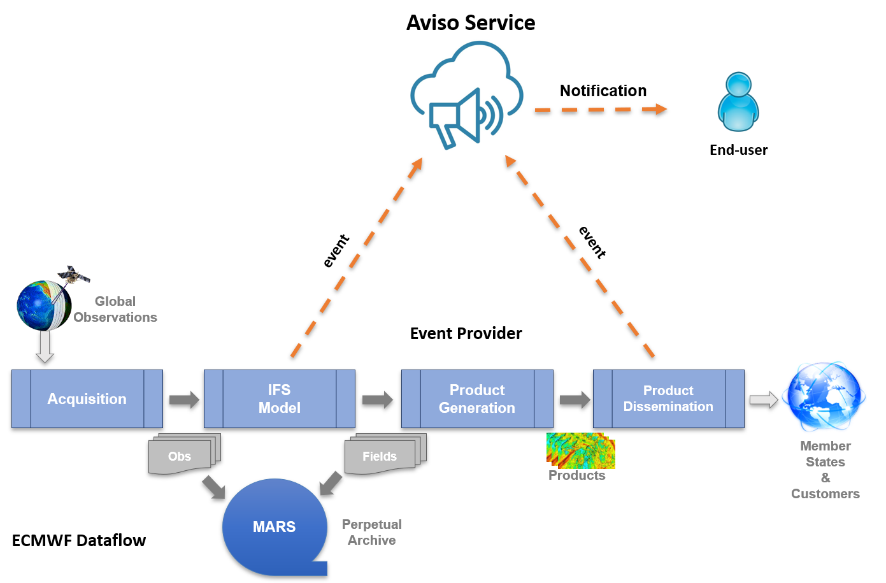

.. _overview:

Overview
========

Aviso is a scalable notification system designed for high-throughput. It is developed by ECMWF with the aim of:

* Notifying **data availability** of:

  * Real-Time Model Output Data
  * Product dissemination via ECPDS

* Intended for **automated** workflows
* Based on an Event system supporting a mechanism **When** <this> … **Do** <that> …

Figure below shows ECMWF data flow; it starts from the data assimilation of observations, it then follows to the generation of the model output, the real-time global forecast. 
This is a time critical step for users' workflows and therefore its completion is notified by Aviso. The data flow continues with the generation of derived products that are then
disseminated via ECMWF ECPDS system. The delivery of these products is also notified by Aviso as users depend on custom products for their downstream applications.  

Aviso is a client-server application. We refer to the notification server as Aviso Service while to the client application as Aviso client or just Aviso. 
This user guide and the reference are focused on Aviso client. See more info on its architecture in :ref:`aviso_client`

The server system is based on a persistent key-value store where the events are stored, the key represents the product's metadata while the value, the product's location.
See more info on the server solution and its components in :ref:`aviso_server`.

Figure below represents the general workflow of the application:

1. Aviso client allows an End-User to subscribe to an event and to program a trigger
2. Aviso client polls for changes to the defined event
3. A notification provider submits a notification
4. The subscriber is notified with a new event
5. The event triggers user’s workflow

.. image:: ../_static/workflow.png
   :width: 50%
   :align: center

