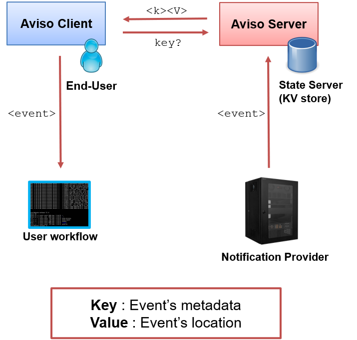

.. _overview:

Overview
========

Aviso is a scalable notification system designed for high-throughput. It is developed by ECMWF - European Centre for Medium-Range Weather Forecasts - with the aim of:

* Notifying **events**
* Triggering users' **workflows**
* Supporting a semantic **When** <this> … **Do** <that> …

Aviso is a client-server application. We refer to the notification server as Aviso Server while to the client application as Aviso client or just Aviso. 
This user guide and the reference are focused on Aviso client. See more info on its architecture in :ref:`aviso_client`.

The server system is based on a persistent key-value store where the events are stored, the key represents the product's metadata while the value, the product's location.
See more info on the server solution and its components in :ref:`aviso_server`.

What could I use Aviso for?
---------------------------

Aviso is developed with the intention of being generic and applicable to various domains and architectures, 
also independently of ECMWF software systems.
Aviso can be used for:

* Automating users' workflows requiring ECMWF notifications on data availability. See next section for more details on this service
* Automating multi-domain workflows across different Clouds and HPC centres. Aviso client can be extended to connect to various general purpose notification systems; similarly 
  Aviso server can be extended to store generic events and integrate with legacy architectures
* Configuration Management. See :ref:`configuration_cli` for more info

ECMWF Aviso service
-------------------

ECMWF has deployed a notification service for the data availability of:

  * Real-Time Model Output Data
  * Products delivered via ECMWF dissemination system

Figure below shows ECMWF data flow; it starts from the data assimilation of observations, it then follows to the generation of the model output, the real-time global forecast. 
This is a time critical step for users' workflows and therefore its completion is notified by Aviso. The data flow continues with the generation of derived products that are then
disseminated via ECMWF dissemination system. The delivery of these products is also notified by Aviso as users depend on custom products for their downstream applications.  

.. image:: ../_static/data_flow.png
   :align: center

This service is based on the Aviso server solution presented in :ref:`aviso_server`. 

.. warning::

   ECMWF Aviso service is currently limited to registered users only. Please contact `ECMWF Service Desk`__ for more details.

__ https://www.ecmwf.int/en/about/contact-us

Aviso General Workflow
----------------

Figure below represents the general workflow of the Aviso application:

1. Aviso client allows an End-User to subscribe to an event and to program a trigger
2. Aviso client polls Aviso server for changes to the defined event
3. A notification provider submits a notification to Aviso server
4. The subscriber is notified with a new event
5. The event triggers the user’s workflow

