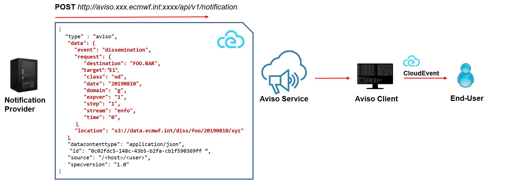

.. _triggers:

Triggers
========
This section lists the various triggers currently available. 
Each trigger will result in an independent process executed every time a notification is received. 

Echo
-------------------
This is the simplest trigger as it prints the notification to the console output. 
It is used for testing and it does not accept any extra parameters.

.. code-block:: yaml

  triggers:
    - type: echo

Log
-------------------
This trigger logs the event to a log file. It is useful for recording the received event. 

.. code-block:: yaml

  triggers:
    - type: log
      path: testLog.log

.. note::

  The trigger process will fail if the directory does not exist.

Command
-------------------
This trigger allows the user to define a shell command to work with the notification.

.. code-block:: yaml

  triggers:
    - type: command
      working_dir: $HOME/aviso/examples
      command: ./script.sh --date ${request.date} --number ${request.number}
      environment:
        AIRPORT: ${request.airport}
        COUNTRY: "The country is ${request.country}"

* ``command`` is the command that will be executed for each notification received. This is a mandatory field.
* ``environment`` is a user defined list of local variables that will be passed to the command shell. This is an optional field.
* ``working_dir`` defines the working directory that will be set before executing the command. This is an optional field.

Moreover, the system performs a parameter substitution in the command and environment fields, for every sequence of the pattern:

* ``${name}``, it replaces it with the value associated to the corresponding key found in the notification received.
* ``${json}``, it replaces it with the whole notification formatted as a JSON inline string.
* ``${jsonpath}``, it replaces it with the file name of a JSON file containing the notification.

A notification is a dictionary whose keys can be used in the parameter substitution mechanism described above. 
Here is an example of a notification:

.. code-block:: json

    {
      "event": "flight",
      "payload": "Landed",
      "request": {
         "country": "italy",
         "date": "20210101",
         "airport": "FCO",
         "number": "AZ203"
      }
    }

Post
-------------------
This trigger allows the user to send as HTTP POST message the notification received and 
formatted accordingly to protocol indicated. Currently the only format implemented is the CloudEvents_ specification and
it can be sent via HTTP to a endpoint or to a AWS topic. 
This trigger basically turns Aviso client in a proxy forwarding the notification to the user's notification system compatible with CloudEvents_ specification, as shown by the figure below:

Here is a basic example of a Post trigger:

.. code-block:: yaml

  triggers:
    - type: post
      protocol:
        type: cloudevents_http
        url: http://my.endpoint.com/api

This is the basic configuration. More parameters can be specified to customise the CloudEvents message. 
More info the reference documentation.

The CloudEvents message sent would look like the following: 

.. code-block:: json

  {
    "type" : "aviso",                              # this is customisable by the user
    "data": {                                      # this is aviso specific
      "event": "flight",
      "payload": "Landed",
      "request": {
         "country": "italy",
         "date": "20210101",
         "airport": "FCO",
         "number": "AZ203"
      }
    },
    "datacontenttype": "application/json",
    "id": "0c02fdc5-148c-43b5-b2fa-cb1f590369ff",  # UUID random generated by aviso
    "source": "https://aviso.int",           # this is customisable by the user
    "specversion": "1.0",
    "time": "2020-03-02T13:34:40.245Z",            # Timestamp of when this message is created
  }

Here is a complete example showing how to customise the CloudEvents fields as well as the HTTP headers:

.. code-block:: yaml

  triggers:
    - type: post
      protocol: 
        type: cloudevents_http
        url: http://my.endpoint.com/api
        headers:
          HTTP_TEST: "test"
        timeout: 30
        cloudevents: 
          type: test_cloudevent
          source: my_test

.. _CloudEvents: https://cloudevents.io/

In the case of a notification to a AWS topic defined by the user, the structure of the trigger is similar; 
the type has to be ``cloudevents_aws`` and ``arn`` and ``region_name`` are the only mandatory parameters. The optionals 
are: ``MessageAttributes``, ``aws_access_key_id``, ``aws_secret_access_key`` for the AWS topic fields and
``cloudevents`` for the CloudEvents fields. Note that if ``aws_access_key_id`` and ``aws_secret_access_key`` are not specified the 
AWS credentials are taken from `~/.aws/credentials` if available.

.. code-block:: yaml

  triggers:
    - type: post
      protocol: 
        type: cloudevents_aws
        arn: arn:aws:sns:us-east-2:848972885776:aviso
        region_name: us-east-2
        MessageAttributes:
          attribute1: 
            DataType: String
            StringValue: valueAttribute1
          attribute2: 
            DataType: String
            StringValue: valueAttribute2 
        cloudevents: 
          type: aviso_topic
          source: my_test

Finally, in case of a AWS FIFO topic ``MessageGroupId`` is required.

Function
-------------------
Differently from the previous triggers, this trigger is not file based. It allows the user to define a Python function 
to be executed directly by Aviso. This is intended for users that want to integrate Aviso Python API into a workflow 
or application written in Python. 

Below find an example of a python script that defines a function to be executed once a notification is received, 
creates a listener that references to this function trigger and finally passes it to aviso to execute.

.. code-block:: python

   from pyaviso import NotificationManager

   # define function to be called
   def do_something(notification):
      print(f"Notification for step {notification['request']['step']} received")
      # now do something useful with it ...

   # define the trigger
   trigger = {"type": "function", "function": do_something}

   # create a event listener request that uses that trigger
   request = {"country": "Italy"}
   listeners = {"listeners": [{"event": "flight", "request": request, "triggers": [trigger]}]}

   # run it
   aviso = NotificationManager()
   aviso.listen(listeners=listeners)

See :ref:`python_api_ref` for more info on how to use Aviso API.

